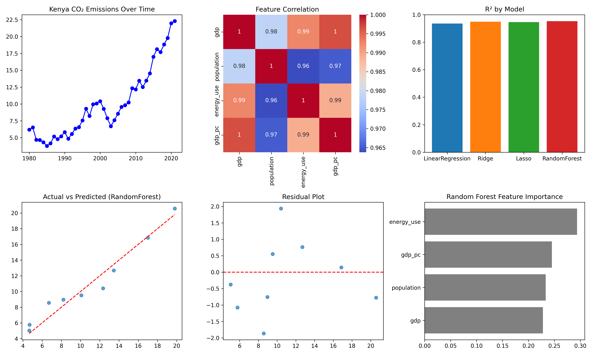

# CO₂ Emissions Predictor — SDG 13: Climate Action

## Overview

This project addresses **Sustainable Development Goal 13 (Climate Action)** by predicting CO₂ emissions for Kenya using multiple regression models. It demonstrates how machine learning can support sustainability by analyzing historical trends and forecasting future emissions.

## Project Highlights

- **Country:** Kenya  
- **Models Tested:** Linear Regression, Ridge, Lasso, Random Forest Regressor  
- **Features Used:** GDP, Population, Energy Use, GDP per Capita  
- **Visualizations:** Emission trends, feature correlations, model performance, residuals, and feature importance

## Dataset

The script automatically loads the [Our World in Data CO₂ dataset](https://github.com/owid/co2-data).

## Results

- Evaluates multiple models and compares their MAE, RMSE, R², and cross-validation scores.
- Automatically generates a multi-panel figure that includes trend lines, correlation heatmap, model performance bars, residual plots, and feature importance.

## Output

Below is the generated multi-panel figure saved as `comprehensive_co2_analysis.png`:



## Ethical Considerations

Bias in historical data, changes in policies, or new technologies can affect prediction accuracy. This model should not be used alone for policy decisions — it is a demonstration of how machine learning can contribute to sustainability planning.

## How to Run

1. Clone or download this repository.
2. Ensure you have Python and the required libraries installed:
```bash
pip install pandas numpy matplotlib seaborn scikit-learn
```
3. Run `python app.py` in your terminal or use Google Colab.
4. The output image `comprehensive_co2_analysis.png` will be saved in the same directory automatically.
5. Review the console output for model scores and notes.